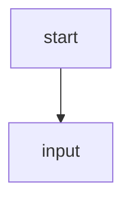

# Bienvenida: Como Funciona Este LearnPack

En este proyecto, cada ejercicio te pide resolver un escenario logico escribiendo un diagrama de flujo Mermaid.

## Donde escribir tu solucion

Edita el archivo `answer.js` dentro de cada carpeta de ejercicio.

Usa este formato:

## Herramienta recomendada

Puedes disenar el diagrama visualmente en [draw.io](https://app.diagrams.net/), luego exportar o copiar el codigo Mermaid y pegarlo en `answer.js`.

Tambien puedes usar [Mermaid Live Editor](https://mermaid.live/).

## Importante

- Usa identificadores de nodos como `A`, `B`, `C`.
- Conecta nodos con flechas.
- Respeta la logica requerida en cada enunciado.

Continua al siguiente ejercicio para empezar.

