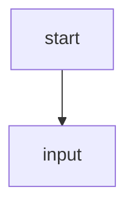

# Welcome: How This LearnPack Works

In this project, each exercise asks you to solve a logic scenario by writing a Mermaid flowchart.

## Where you write your solution

Edit the file `answer.js` inside each exercise folder.

Use this format:

## Recommended tool

You can design your diagram visually in [draw.io](https://app.diagrams.net/), then export or copy Mermaid code and paste it into `answer.js`.

You can also use [Mermaid Live Editor](https://mermaid.live/).

## Important

- Use node ids like `A`, `B`, `C`.
- Connect nodes with arrows.
- Respect the required logic from each exercise statement.

Continue to the next exercise to start solving.

